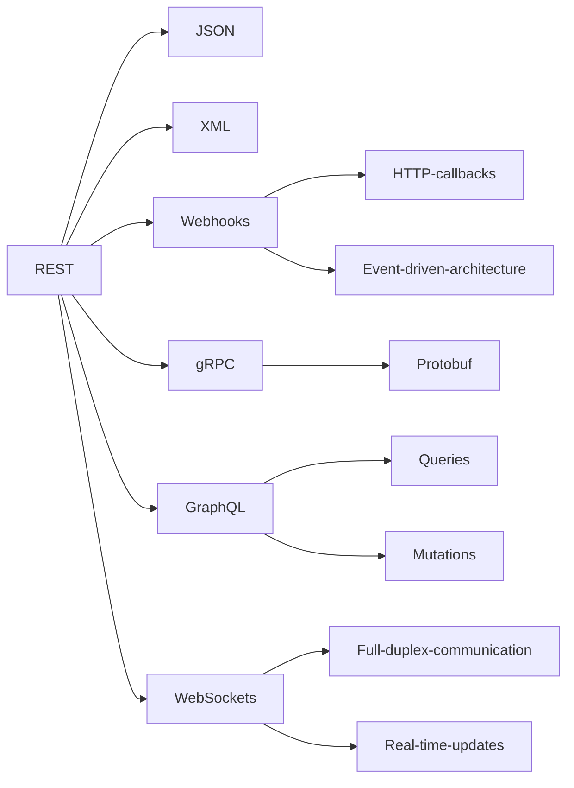

- [Attendance WebApp](#attendance-webapp)
  - [Introduction](#introduction)
  - [Attendance WebApp Architecture (re-architected)](#attendance-webapp-architecture-re-architected)
    - [2018-Attendance WebApp high level Architecture](#2018-attendance-webapp-high-level-architecture)
    - [Attendance WebApp UI](#attendance-webapp-ui)
  - [Refer to the Wiki for details on the project](#refer-to-the-wiki-for-details-on-the-project)
- [Project general guidelines](#project-general-guidelines)
  - [API/Services Architectures](#apiservices-architectures)
  - [Extra mermaid diagram](#extra-mermaid-diagram)
  - [Setup](#setup)
- [Build WebApp](#build-webapp)
  - [Gradle Build Web Package](#gradle-build-web-package)
  - [Maven Build](#maven-build)
- [Package WebApp](#package-webapp)
  - [Docker Image Build](#docker-image-build)
    - [Available Tomcat versions](#available-tomcat-versions)
- [Run WebApp](#run-webapp)
  - [Docker execution](#docker-execution)
  - [Docker](#docker)
    - [Run and test the container webapp](#run-and-test-the-container-webapp)
  - [Editing project diagrams](#editing-project-diagrams)
  - [GitHub Vulnerability report](#github-vulnerability-report)
  - [Web services client](#web-services-client)
    - [SOAP](#soap)

# Attendance WebApp

## Introduction

Attendance WebApp is a proof of concept to improve the way attendance is managed at AUT university.

The application uses maven, J2EE, primefaces, gson.
```kotlin
    maven {
         url = uri("https://repository.primefaces.org")
    }
```
The idea is that you have a short timeframe to submit a random generated code by the lecturer so that attendance can be registered in the system.

The application is a proof of concept for Service orientation and Service interoperability in the cloud

> Security Warning
GitHub found 2 vulnerabilities on aleon1220/multi-cloud-WebApp-Attendance's default branch (2 moderate).
To find out more, visit:
[This project security report](https://github.com/aleon1220/multi-cloud-WebApp-Attendance/security)

## Attendance WebApp Architecture (re-architected)

2018 project with a lot of things to change

* Simplification of used services
* Streamline app to use 100% rest and deprecate SOAP and WSDL
* Create a simple test OpenLDAP instance for users and roles
* Host the WebApp in Azure
* Host the backend functionality in AWS
* use diagrams.net for the diagrams

### 2018-Attendance WebApp high level Architecture


### Attendance WebApp UI


## Refer to the Wiki for details on the project

[Detailed Project Wiki][95f44386]

  [95f44386]: https://github.com/aleon1220/multi-cloud-AttendWebApp/wiki/4-Architecture-and-Technical-Design "Project Wiki"

# Project general guidelines

1. Installation process: project a Java project JEE. Import in any IDE and build with gradle or maven. Build docker image and run
2. Software dependencies: dependencies are described in pom.xml file
3. Latest releases by using git tags
4. API references. API docs

## API/Services Architectures

## Extra mermaid diagram
circular references

[](https://mermaid.live/edit#pako:eNptksEOgjAQRH-F7Fl-gIMXNV4wUTDx0kulKxCEklIOhvDvtmAoXeypfTOdySY7QCYFQgS54m0RxAlrAnOSU3oPwnAf5Mn1QNDZOm8xoQ98pjKrUHdboZCyMngWbOIkWAdBXvRCafRa8KJ_30n6mrpx1pQWEM3rcF5SQwTXRARvRqL9KZve2yqHvSKHaY1TXCfsoEZV81KYBRislYEusEYGkbkKrioGrBmNj_dapp8mg-jF3x3uoG8F13gsuVmceqEoSi3VZV6pabPGL4act8s)

## Setup
> Tested in Win11 with WSL, Github codespaces and Ubuntu22

- Clone repo
```bash
git clone repo
```

- open repo in chosen IDE
IDEs can be Eclipse, IntelliJ (suggested) or use online IDE (Github codespaces)
# Build WebApp
## Gradle Build Web Package
- Pack the WebArchive file. Generate the .WAR file
``` bash
gradle clean build --console plain --warning-mode all
```

## Maven Build
> maven has been deprecated and moved to [maven](./maven)

# Package WebApp
## Docker Image Build
- Build the app image with Docker. Deploy .WAR file in Tomcat
refer to https://hub.docker.com/_/tomcat
```bash
docker build --tag aleon1220/soa:latest .
```

### Available Tomcat versions
Use the tag latest or a particular version e.g. aleon1220/soa:v2 or aleon1220/soa:latest
- 7.0.109 = `TOMCAT_VERSION_DOCKER_TAG="7.0.109-jdk8-openjdk"`
- 9.0.78  = `TOMCAT_VERSION_DOCKER_TAG="9.0.78-jre8"`

# Run WebApp
## Docker execution
Run the tomcat server with the pre-built WAR web Archive file
```bash
docker run -itd --publish 8888:8080 aleon1220/soa:latest
```
- get the name of the running container in port 8888
``` bash
CONTAINER_NAME=$(docker container ls --all --filter publish=8888 --format "{{.Names}}")
```

- Access the Docker container via CLI

```bash
docker container exec -it $CONTAINER_NAME /bin/bash
```

- The URl is URL:8888/Attendance-0.0.1 [AttendanceWebApp](http://localhost:8888/Attendance-0.0.1)

- clean up docker container environment
``` bash
docker stop $(docker ps --quiet)
docker rm $(docker container ls --all --quiet)
```

## Docker
### Run and test the container webapp
```bash
docker build --tag aleon1220/soa:latest .
docker run -itd --publish 8888:8080 --name attendance_webapp_container aleon1220/soa:latest
```

## Editing project diagrams
- go to [diagrams.net](https://app.diagrams.net/?src=about)
- open the file [project-diagrams.drawio](./project-diagrams.drawio) XML file with the diagrams
- Explore > export images to convinience and update this README
## GitHub Vulnerability report

https://github.com/aleon1220/multi-cloud-WebApp-Attendance/security/dependabot

## Web services client
### SOAP
get a WSDL online and then use a CXF utility to generate the java code

wsdl2java is a command-line tool from Apache CXF used to generate Java code from a WSDL document1. Here’s how you can use it:

Download the WSDL file: You need to have the WSDL document saved on your local machine2.

Run the wsdl2java command: The basic syntax of the command is as follows:
```bash
wsdl2java -fe <front-end-name> -db <data-binding-name> -wv <wsdl-version> -p <[wsdl-namespace =]package-name>* -sn <service-name> -d <output-directory> <path-to-wsdl-file>
```

Here’s what some of the options mean:

-fe frontend-name: Specifies the frontend. Default is JAXWS.
-db databinding-name: Specifies the databinding. Default is JAXB.
-wv wsdl-version: Specifies the WSDL version. Default is WSDL1.1.
-p [ wsdl-namespace= ] PackageName: Specifies zero, or more, package names to use for the generated code.
-sn service-name: The WSDL service name to use for the generated code.
-d output-directory: The directory where the generated code will be placed.
Compile and run the generated code: Once you have generated the code, you can compile and run it as you would with any other Java code.
Please note that if your WSDL file is secured (for example, accessed over HTTPS), you might encounter issues with SSL handshake3. In such cases, you might need to manually download and reference any XSD files used in your WSDL2.

Remember to replace <front-end-name>, <data-binding-name>, <wsdl-version>, <[wsdl-namespace =]package-name>*, <service-name>, <output-directory>, and <path-to-wsdl-file> with your actual values.

For more advanced usage and options, please refer to the official Apache CXF documentation. https://cxf.apache.org/docs/wsdl-to-java.html

2023-10-28
after some serious struggle trying to get wdl2java to work for a simple WSDL file I found online i have found a solution
- i tried using multiple plugins in gradle kotlin DSL. fail
- i tried switching to maven and using the official CXF. Fail several times
- in maven upgraded to java17 and ajdusted simple settings OK
- I followed docs https://cxf.apache.org/docs/maven-cxf-codegen-plugin-wsdl-to-java.html and https://cxf.apache.org/docs/wsdl-to-java.html
- wsdl is ready
